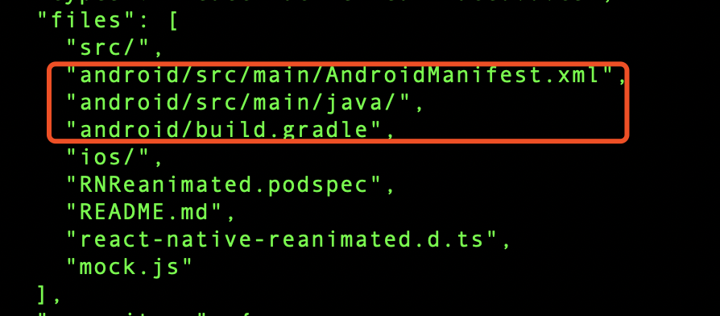

## 团队协作的格式化

JS 工程推荐使用 [VSCode 的 ESLint 插件](https://marketplace.visualstudio.com/items?itemName=dbaeumer.vscode-eslint)，保存的时候自动格式化，统一团队代码风格


## 常用脚本
### JS 工程的自动化打包

以 `rn-popular` 工程为例

使用 `rn_build.sh` 脚本来一键打包，自动生成 main.jsbundle、sourcemap.js、assets 文件夹和当前 Git CommitHash 信息，并自动复制到快影工程

### Native 组件的自动生成（iOS）

以 `rn-popular` 的 iOS 工程为例

某些组件除了需要更新 JS 组件，也得更新 Native 组件。

如何更新 Native 组件呢？

1. 修改 iOS 的 Podfile（具体命令需要参照具体的组件说明）
2. 使用 `rn_build_native.sh` 脚本一键生成 Native 组件对应的框架，包括 debug 和 release 两种版本

### Pod 的一键打包（iOS）

以 `kwai_react_native_ios` 工程为例

快影对 RN Native 组件是采用 Pod 依赖，因此生成的 Native 组件我们需要更新到 Pod 源上

1. 将新增的 .framework 添加到 `debug_libraries` 和 `release_libraries`
2. 执行 `./deploy_all.sh 版本号` 一键完成所有部署
3. 快影工程更新 podfile 文件并 install


## 第三方组件
纯 JS 库可以直接集成，注意包大小即可。部分三方库会包含 native 实现，重新打终端包。目前 KRN 内置以下 native module，如果需要集成新的 native 库**联系终端开发**重新打包

### 常用的纯 JS 组件列表

```json
"@react-native-community/masked-view": "^0.1.10",
"@react-native-community/slider": "^3.0.0",
"react": "16.11.0",
"react-native": "0.62.2",
"react-native-gesture-handler": "^1.6.1",
"react-native-linear-gradient": "^2.5.6",
"react-native-reanimated": "^1.9.0",
"react-native-safe-area-context": "^3.0.5",
"react-native-screens": "^2.8.0",
"react-native-video": "^5.0.2",
"@react-native-community/netinfo": "^5.9.3",
"react-native-create-thumbnail": "^1.2.1",
"react-native-fs": "^2.16.6"
```

### 已接入的 Native 组件列表
引入 Native 组件列表会增大安装包大小，因此需要谨慎添加，请确保你要新增的 Native 组件的功能不会与以下已有的组件重复

```json
react-native-cookies
react-native-safe-area-context
react-native-slider	
react-native-video
```

[iOS 最新的实时组件列表请参见这里](http://git.corp.kuaishou.com/chenying09/kwai_react_native_ios/-/tree/master/release_libraries)


### 如何判断组件是否需要 Native 支持
+ 运行时错误包含以下堆栈


+ README.md 说明包含 native 库，需要执行 react-native link 命令。或者 package.json 包括以下内容



### 怎么找三方库
建议使用时留意 issue，三方库的质量

+ [官方库商店](https://reactnative.directory/)：经过筛选，有评分，但是数据更新落后，例如 issue 数量貌似不是很新
+ [npm 商店](https://www.npmjs.com/)：数据新，数量多，但是质量参差不齐
+ [npmtrends](https://www.npmtrends.com/)：对比同类型库下载数、issue、star，选型非常有用


## 开发经验
### 沉浸式视频的内存优化
开发上热门业务时，沉浸式视频列表使用的是 RN 自带的 List 组件，该组件在 Native 上是使用 scrollView 实现的，假如我们有 30 个视频数据，那么首次渲染的时候就会把这 30 个视频同时渲染出来，这样会导致内存暴涨。


一种可行的优化方法是根据 index 进行选择性渲染，这里的一个小技巧是对于视频，渲染当前视频的前后 1 个；对于海报图，渲染当前视频的前 2 个和后 8 个（而不是前后 5 个），以此保证用户不断往下翻视频的流畅体验

```js
render() {
	const showVideo = Math.abs(this.props.index - this.props.activeIndex) <= 1;
	const showImage = this.props.index <= this.props.activeIndex + 8 && this.props.index >= this.props.activeIndex - 2;
	{showVideo ? <Video></Video>}
	{showImage ? <Image></Image>}
}
```


